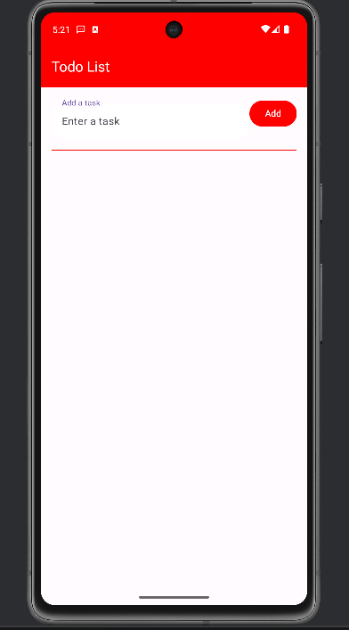
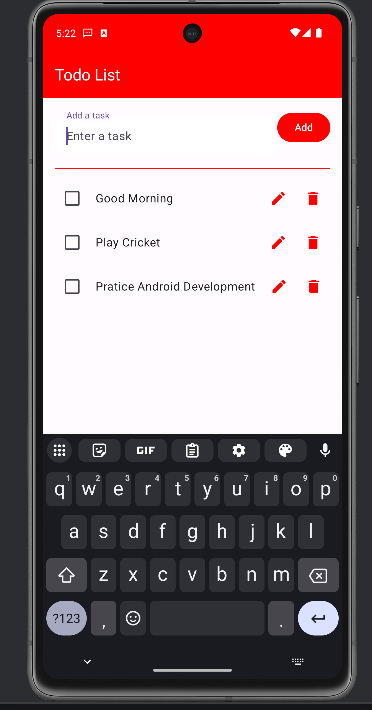
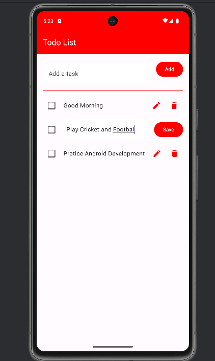

📝 TodoList App

A simple and efficient **Todo List Android application** built using **Kotlin** and **Jetpack Compose**.  
The app helps users manage daily tasks with full **CRUD operations** and local data persistence using **Room Database**.

---

##  Features

-  Add new tasks  
-  Update / Edit existing tasks  
-  Delete tasks  
-  Offline storage using Room Database  
-  Reactive UI with Jetpack Compose  
-  Clean architecture using MVVM  

---

##  Tech Stack

- **Language:** Kotlin  
- **UI:** Jetpack Compose  
- **Architecture:** MVVM (Model–View–ViewModel)  
- **Database:** Room Database  
- **State Management:** StateFlow / Flow  
- **Lifecycle Handling:** Lifecycle-aware components  

---

##  Screenshots

  
   
   

---

